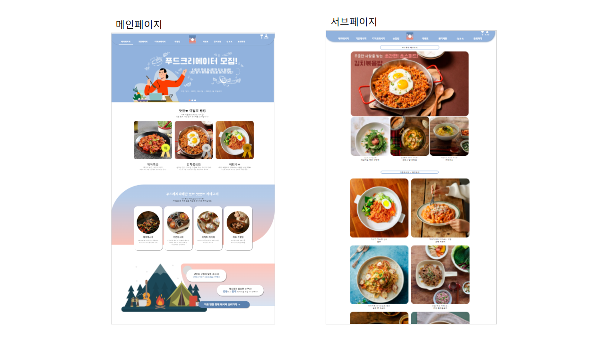
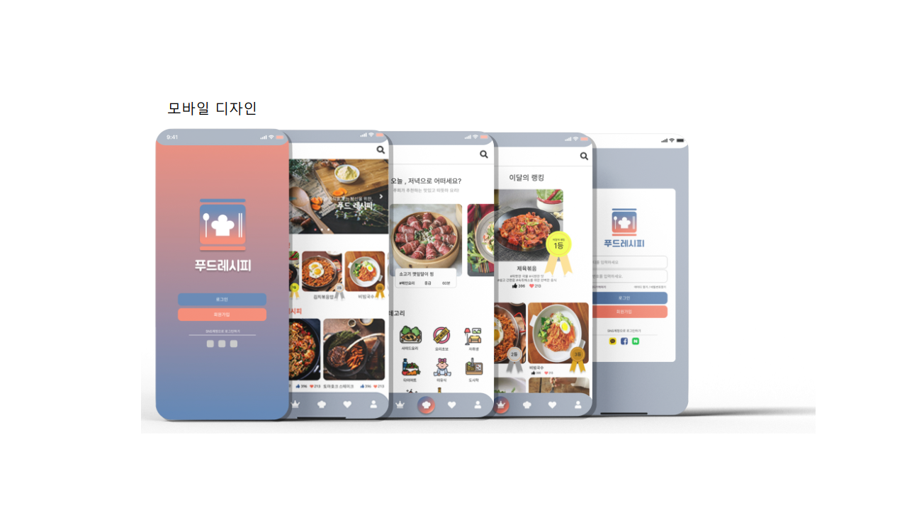

# 푸피(푸드레시피) 기획안

<aside>
💡 제작기간 2022.01.03 - 2022.01.17

</aside>

## 기여도

|  | PC - 메인  | PC - 서브페이지 | 모바일 프로토타입 |
| --- | --- | --- | --- |
| 디자인 | 100% | - | 70% |
| 코딩 | 100% | 20% | X |

# 1. 웹페이지 기획

요리 재료 손질 방법, 식사 메뉴 추천, 맞춤형 레시피 제공으로 편리하고 맛있는 음식을 먹을 수 있도록 도움을 주는 레시피 사이트

- 요리 초보자들을 위한 재료 손질방법부터 요리 고수들을 위한 다양한 레시피까지 제공합니다.
- 다이어트 식단을 찾거나 건강식, 매일 식사 메뉴를 고민하는 사람들을 위해 그 에 맞게 효과적으로 도움을 줍니다.

# 2. 페이지 구성 및 상세설명

## 2-1. PC코딩



### 1-1. 메인페이지

1. 배너 슬라이드

 - bxslider 캐러셀 제이쿼리 플러그인 사용하여 구현

1. 동적 애니메이션

 - AOS 오픈 소스를 이용해 동적 움직임 구현

1. 하단 슬라이드
    
    ```jsx
    //본문5 핫한 레시피 슬라이드
        var i =1;
        $('.right').click(function(){
            if(i<6){
                $('#slide').animate({'margin-left':'-=290px'});
                i++
                console.log(i);
            };        
        });
        $('.left').click(function(){
            if(i>1 && i<7){
                $('#slide').animate({'margin-left':'+=290px'});
                i--;
                console.log(i);
            };        
        });
    ```
    

## 모바일 UI & UX 디자인 및 프로토 타입(FIGMA)



- [디자인과 피그마](https://www.figma.com/file/FpxkSHP6uX0ljqHHzslodq/%ED%83%80%EC%9D%B4%EB%A0%88%EB%86%80---%ED%91%B8%EB%93%9C%EB%A0%88%EC%8B%9C%ED%94%BC)를 통한 [프로토 타입](https://www.figma.com/proto/FpxkSHP6uX0ljqHHzslodq/%ED%83%80%EC%9D%B4%EB%A0%88%EB%86%80-%ED%91%B8%EB%93%9C%EB%A0%88%EC%8B%9C%ED%94%BC?scaling=scale-down&page-id=0%3A1&starting-point-node-id=219%3A6792) 제작

# 3. 프로젝트를 마치며

처음으로 디자인과 pc코딩을 한 프로젝트이다. 자바스크립트와 제이쿼리에 대해 잘 알지 못해 플러그인을 사용해 애니메이션을 구현하였지만, 하단의 슬라이드는 내가 직접 쓴 코드로 구현하고 싶어 열심히 머리를 굴려가며 만들었다.  처음으로 구현한 슬라이드여서 생각한 것 보다 막막했고 시간이 많이 걸렸던 프로젝트였다. 

다음에는 플러그인을 사용하지 않고 직접 구현하도록 공부하려고 한다.